<div align="center">
  
</div>

<div align="center">

[](https://www.linkedin.com/in/gancheng-luo-andy/) [](mailto:andy8647lgc@gmail.com) [](https://unsplash.com/@andy8647)

</div>

---

## About

```python
andy = {
    "is": "a full-stack engineer who builds agents — heaviest on the backend",
    "agent_layer": [
        "RAG — chunking, hybrid retrieval, reranking, citations",
        "prompt & context engineering — what goes in the window, and what doesn't",
        "MCP servers & tool calling — agents that change state, not just describe it",
        "evals — measure the pipeline instead of trusting the demo",
    ],
    "backend_under_it": [
        "FastAPI · SQLAlchemy · Alembic · Postgres · Redis",
        "Kafka for the async seams, Kubernetes and Docker to run it",
        "a model layer that swaps Anthropic/OpenAI/DeepSeek/Gemini",
    ],
    "also": "computer vision, trained and shipped on-device",
    "off_duty": "photography — 7M views / 57K downloads on Unsplash",
    "education": [
        "MIT (Artificial Intelligence) @ UNSW Sydney (2025–2026)",
        "BSc Computer Science @ University of Toronto",
    ],
    "before_agents": "4 years full-stack — commonsku, SnapPay",
    "based_in": "Shanghai · remote",
}
```

---

## What I'm Building

**Agent harness UI & tooling** — extensions for the [pi](https://pi.dev) coding agent, built because a long-running agent kept breaking. Sorted by npm downloads (last month).

[github.com/Andy8647/pi-toolbox](https://github.com/Andy8647/pi-toolbox): one consistent frame around every tool call — built-ins, MCP, subagents — with bash syntax highlighting. [](https://www.npmjs.com/package/@andy8647/pi-toolbox)

[github.com/Andy8647/pi-starline](https://github.com/Andy8647/pi-starline): **Starline** — a Starship-inspired statusline and Opencode-style TUI for pi. Pill footer with directory, git branch & status, runtime detection, context usage, token counts and cost at a glance; themeable colour palette with `$ref` expansion, fully custom `footerFormat` templates, `model`/`thinking` segments; bordered editor with accent rail, per-mode cursor styles and mouse selection. Forked from pi-zentui, since diverged well past upstream. [](https://github.com/Andy8647/pi-starline)

[github.com/Andy8647/pi-balance](https://github.com/Andy8647/pi-balance): real-time API provider balance in the pi status bar — DeepSeek, Moonshot, OpenRouter, Codex and more.

[github.com/Andy8647/pi-ide-context](https://github.com/Andy8647/pi-ide-context): `/ide` for pi. Select text in Neovim or VS Code, switch to the agent — it already knows the file, cursor and selection. No copy-paste. [](https://www.npmjs.com/package/pi-ide-context)

[github.com/Andy8647/pi-agent-loop](https://github.com/Andy8647/pi-agent-loop): cross-provider rate-limit detection and auto-resume. Tells a soft quota limit apart from a hard 403, waits for the real reset, picks the task back up. [](https://www.npmjs.com/package/@andy8647/pi-agent-loop)

```bash
pi install npm:@andy8647/pi-agent-loop
pi install npm:pi-ide-context
pi install npm:@andy8647/pi-toolbox
```

**Agent internals** — context engineering and the failure modes underneath

[github.com/Andy8647/superpowers](https://github.com/Andy8647/superpowers) (fork): plan generation kept dying on long runs — past ~119K tokens prompt cache dropped to zero, and a 3,000-line plan in one response got the stream killed. The fix was structural, not prompt-level: split plans into an index plus self-contained per-task files, so the controller reads only the index and each subagent reads only its own task. 9 files, +216/−108.

[github.com/Andy8647/pdf-injection-scanner](https://github.com/Andy8647/pdf-injection-scanner): finds prompt injection hidden inside PDFs before an agent reads them — white text, 0.1pt fonts, content positioned off-page. [](https://github.com/Andy8647/pdf-injection-scanner)

[github.com/Andy8647/agent-atlas](https://github.com/Andy8647/agent-atlas): interactive learning platform for the agent application layer — ReAct through harness engineering.

**Computer vision** — trained, converted, shipped to a device

[github.com/Andy8647/MahjongVis](https://github.com/Andy8647/MahjongVis): real-time mahjong tile recognition on iPhone. 3,713 self-annotated images across 42 classes, YOLOv8s trained 150 epochs, converted to CoreML with built-in NMS, running live through SwiftUI + AVCaptureSession.

---

## Tech

<div align="center">

**Agents & LLM** &nbsp;


**Backend & Infra** &nbsp;
[](https://skillicons.dev)

**Frontend** &nbsp;
[](https://skillicons.dev)

**Vision & On-device** &nbsp;
[](https://skillicons.dev)


</div>

---

<div align="center">
  
</div>

<div align="center">
  <picture>
    <source media="(prefers-color-scheme: dark)" srcset="https://raw.githubusercontent.com/Andy8647/Andy8647/output/github-snake-dark.svg" />
    <source media="(prefers-color-scheme: light)" srcset="https://raw.githubusercontent.com/Andy8647/Andy8647/output/github-snake.svg" />
    
  </picture>
</div>

<div align="center">


</div>
